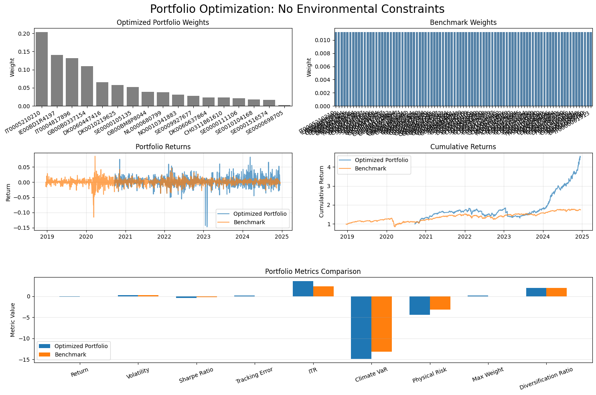
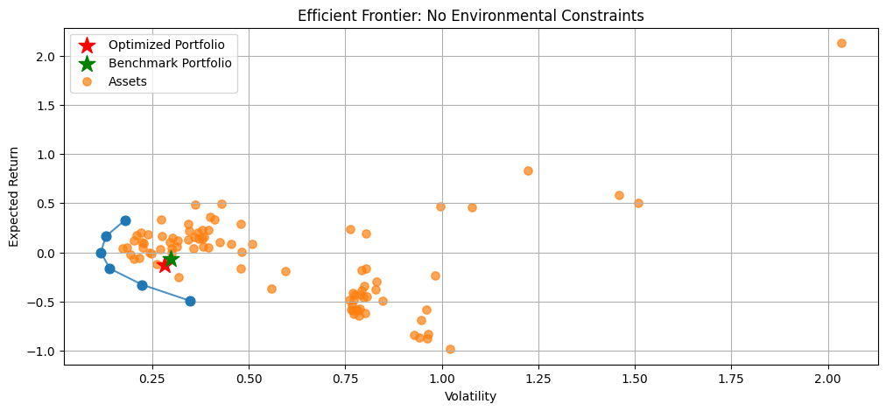
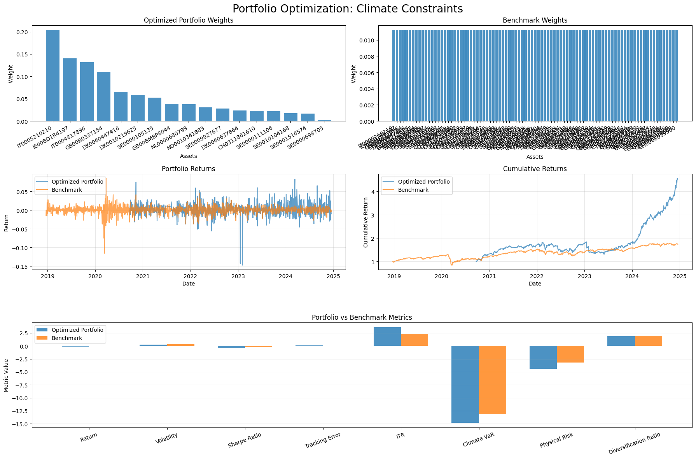
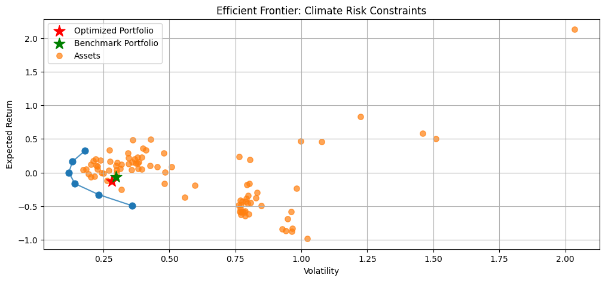
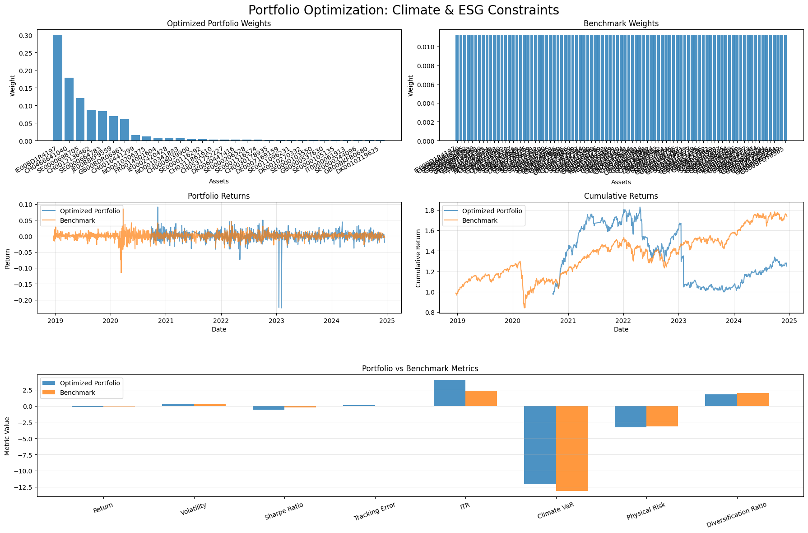
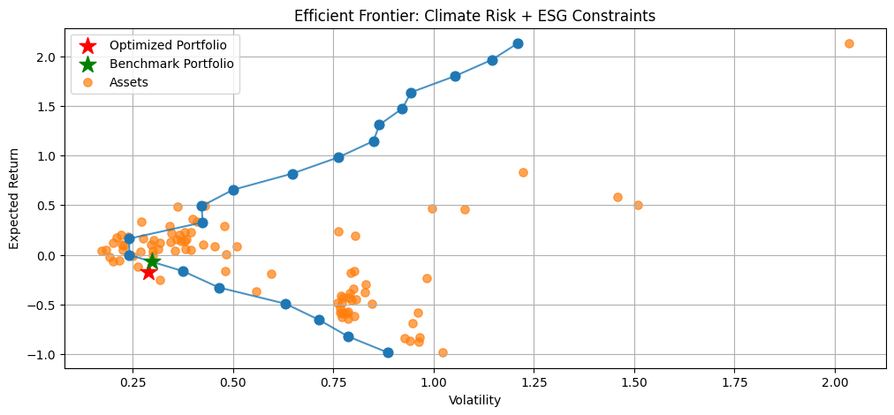
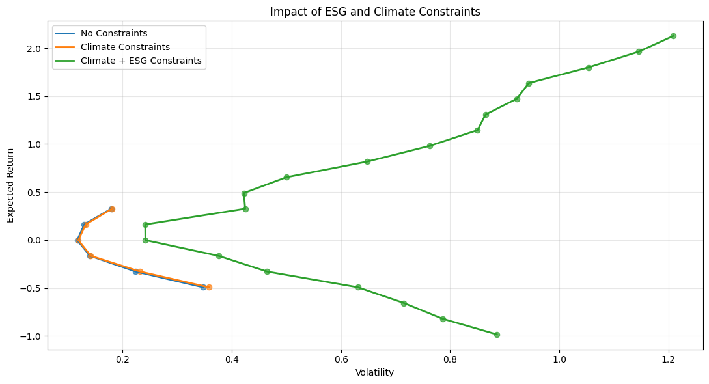

# Project Goal

The goal of this project is to construct an equity portfolio that:
* Maximizes financial performance (expected return / risk trade-off)
* Remains diversified
* Is aligned with a 2°C climate trajectory
* Minimizes exposure to:
    * Physical climate risks
    * Transition risks (Climate VaR)
* Incorporates ESG preferences

 

The investment universe is composed of constituents from the **MSCI Europe index**.

  

### Investment Constraints

The portfolio is formulated as a **constrained optimization problem** combining:
* Financial objectives (return, variance, tracking error)
* ESG and climate alignment metrics
* Structural portfolio constraints (diversification, long-only, full investment)

 

|      |    Constraint | Description |  Expression  |
|---|----|------|--------|
|  Diversification   | (1)   Maximum issuer weight | A single issuer cannot represent more than **10%** of the total portfolio weight |     $$w_i \leq 0.10 \quad \forall i$$  |
|     |     (2)   Concentration limit | The sum of all issuers with weights greater than **5%** cannot exceed **40%** of the portfolio |   $$\sum_{i=1} \max(w_i - 0.05, 0) \leq 0.40$$  |
|  Climate |  (3)   Temperature alignment constraint | The weighted average portfolio `Implied Temperature Rise [°C]` must remain below **2°C** and below the investment universe average |   $$ ITR_p = \sum_{i=1} w_i \cdot ITR_i $$  $$ ITR_p \leq 2.0 $$  $$ ITR_p \leq \frac{1}{N} \sum_{i=1}^{N} ITR_i $$   |
|    |   (4)   Climate VaR constraint | The portfolio aggregated `Climate VaR` must remain below the investment universe Climate VaR |   $$ CVaR_p = \sum_{i=1}^{N} w_i \cdot CVaR_i $$  $$ CVaR_p \leq \frac{1}{N} \sum_{i=1}^{N} CVaR_i $$ |
|  Portfolio construction |    (5)   Fully invested portfolio | The sum of portfolio weights must equal **100%** |    $$\sum_{i=1} w_i = 1$$ |
|    |    (6)   Long-only portfolio | Portfolio weights must remain positive or null |     $$w_i \geq 0 \quad \forall i$$    |

 

### Data
_____

| Filename | Sheet Name | Content | 
|---|---|---|
| `Indice_de_reference.xlsx` | `Composition` | MSCI Europe constituents (405 issuers) | 
| | `Histo` | 6-year daily prices of the index  |
| `Historique_des_cotations.xlsx` | Main sheet | Historical closing prices of the index constituents over 6 years  |  
| `DATA_SRI.xlsx` | `Data` | Governance, environmental, social indicators (~225 variables) over 5 years |  
| `Climate Risk Report.xlsx` | `Security Data` | Climate alignment, transition risks and physical climate risks of the index constituents (~132 variables)  |

  

### Key Findings
______

#### Unconstrained Portfolio Dashboard

This portfolio represents a pure mean-variance optimization with no ESG or climate restrictions:
- characterized by strong concentration and aggressive return maximization

The unconstrained frontier shows the classical mean-variance trade-off with a smooth concave structure

  

    
  

  

    
  

 

#### Climate-Constrained Portfolio Dashboard

The inclusion of climate constraints (ITR, Climate VaR, physical risk) has limited impact on allocation:
- the portfolio remains structurally similar to the unconstrained case, suggesting weakly binding constraints

The frontier remains almost identical to the unconstrained case, confirming that climate constraints are not strongly binding in this universe

  

    
  

  

    
  

 

#### Climate + ESG Portfolio Dashboard

Adding ESG constraints significantly changes portfolio composition:
- the allocation becomes more diversified and shifts toward ESG-compliant assets, at the cost of financial efficiency

The ESG-constrained frontier is significantly distorted and expanded, reflecting a restricted and reshaped investment universe

  

    
  

  

    
  

 

 

